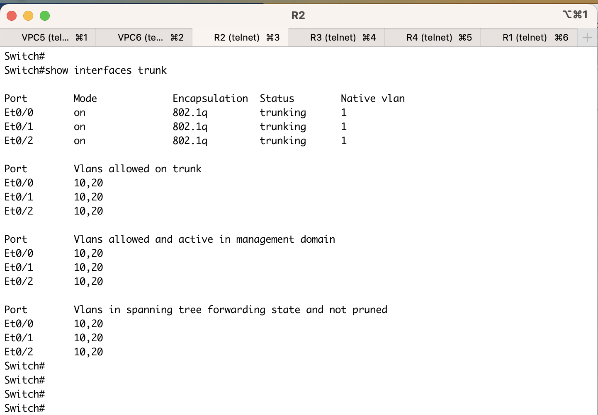

# Отчет о дз1 (сделал на 10 баллов)

Итоговый файл конфигурации загрузил в [hw1.unl](data/hw1.unl)
Файлы с конфигами самих нод тоже доступны:

- [R1 configuration](data/r1.conf) 
- [R2 configuration](data/r2.conf) 
- [R3 configuration](data/r3.conf) 
- [R4 configuration](data/r4.conf) 
- [VPC5 configuration](data/vpc5.conf)
- [VPC6 configuration](data/vpc6.conf)

## Скриншот конфигурации


## Список команд по нодам:

- R1 (Router Cisco IOL L3)
```
enable
configure terminal
interface e0/0
no shutdown
interface e0/0.10
encapsulation dot1q 10
ip add 10.0.10.2 255.255.255.0
exit 
interface e0/0
no shutdown
interface e0/0.20
encapsulation dot1q 20
ip add 10.0.20.2 255.255.255.0
exit 
exit
copy running-config startup-config 
```
- R2(Switch Cisco IOL L2)
```
enable 
configure terminal 
vlan 10
vlan 20
exit 
interface e0/0
switchport trunk allowed vlan 10,20
switchport trunk encapsulation dot1q
switchport mode trunk
exit 
interface e0/1
switchport trunk allowed vlan 10,20
switchport trunk encapsulation dot1q
switchport mode trunk
exit 
interface e0/2
switchport trunk allowed vlan 10,20
switchport trunk encapsulation dot1q
switchport mode trunk
exit 
exit 
copy running-config startup-config 
```
- R3 (Switch Cisco IOL L2)
```
enable 
configure terminal 
vlan 10
vlan 20
exit 
interface e0/0
switch access vlan 10
switch mode access
exit 
interface e0/1
switchport trunk allowed vlan 10,20
switchport trunk encapsulation dot1q
switchport mode trunk
exit 
interface e0/2
switchport trunk allowed vlan 10,20
switchport trunk encapsulation dot1q
switchport mode trunk
exit 
exit 
copy running-config startup-config 
```
- R4 (Switch Cisco IOL L2)
```
enable 
configure terminal 
vlan 10
vlan 20
exit 
interface e0/0
switch access vlan 20
switch mode access
exit 
interface e0/1
switchport trunk allowed vlan 10,20
switchport trunk encapsulation dot1q
switchport mode trunk
exit 
interface e0/2
switchport trunk allowed vlan 10,20
switchport trunk encapsulation dot1q
switchport mode trunk
exit 
exit 
copy running-config startup-config 
```
- VPC5 (встроенный vpc)
```
ip 10.0.10.1/24 10.0.10.2
```
- VPC6 (встроенный vpc)
```
ip 10.0.20.1/24 10.0.20.2
```


## Spanning-tree:
Убедимся, что spanning-tree корректно построилось с помощью команды (На всех свичах)
```
show spanning-tree
```
### R2 spanning tree (видно что она везде рут по всем vlan)

### R3 spanning tree 

### R4 spanning tree 


Как можно видеть, дерево построилось корректно

## Настройки портов и VLAN

Посмотрим настройки портов и vlan с помощью команд на свичах
```
show vlan
show interfaces trunk
```

### R2 VLAN/Interfaces

### R3 VLAN/Interfaces

### R4 VLAN/Interfaces


Так же посмотрим на настройки роутера с помщоью команды 
```
show ip route
```

### R1 IP ROUTE 


## Убедимся, что мы все корректно настроили (проверка PING)

### PING FROM VPC5


### PING FROM VPC6


Все прошло успешно, Ура!

Как можно заметить, сеть отказоустойчива к отказу одного из ребер между коммутаторами, потому что они соединены вот в такое кольцо.