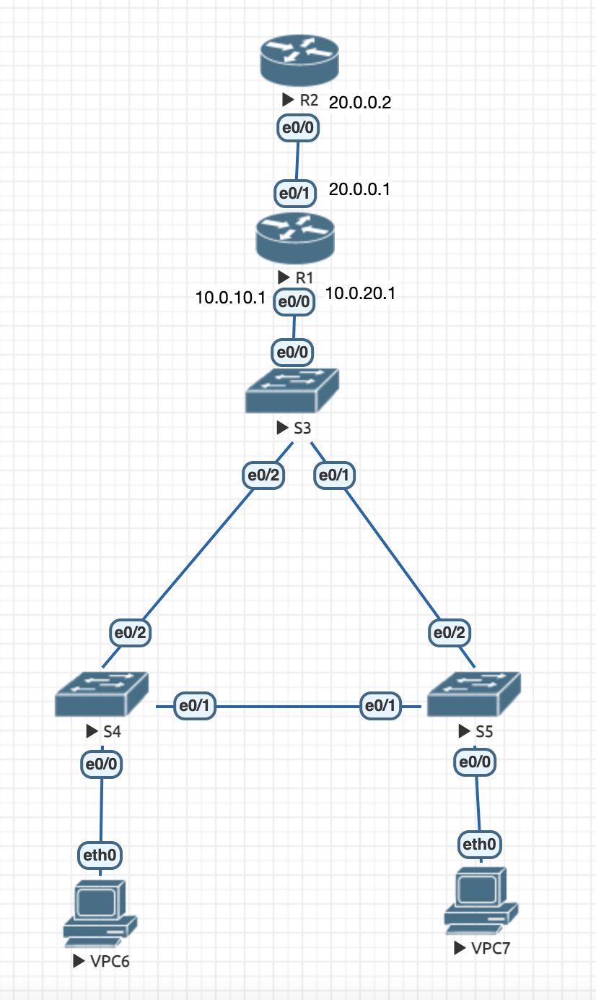
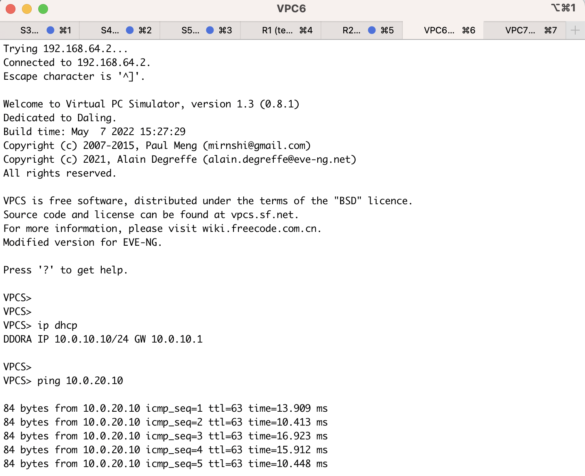
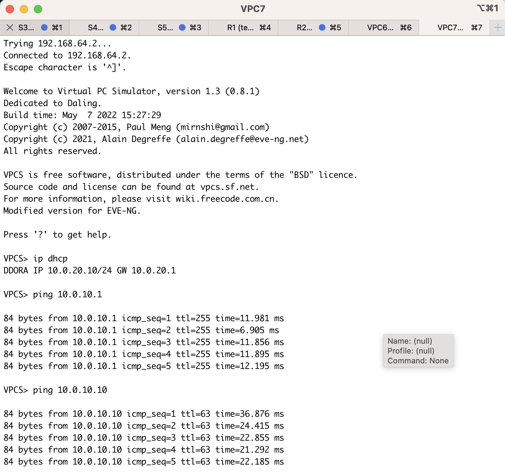
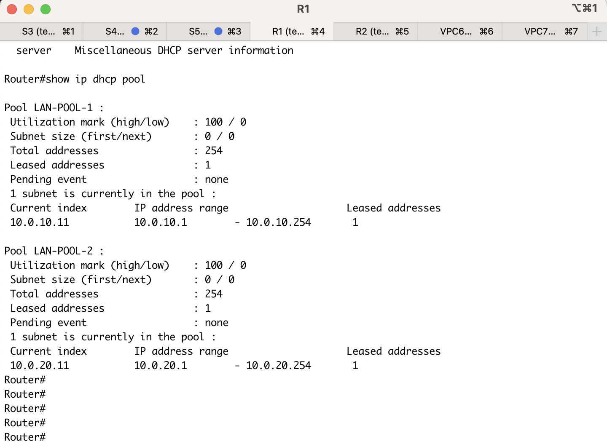
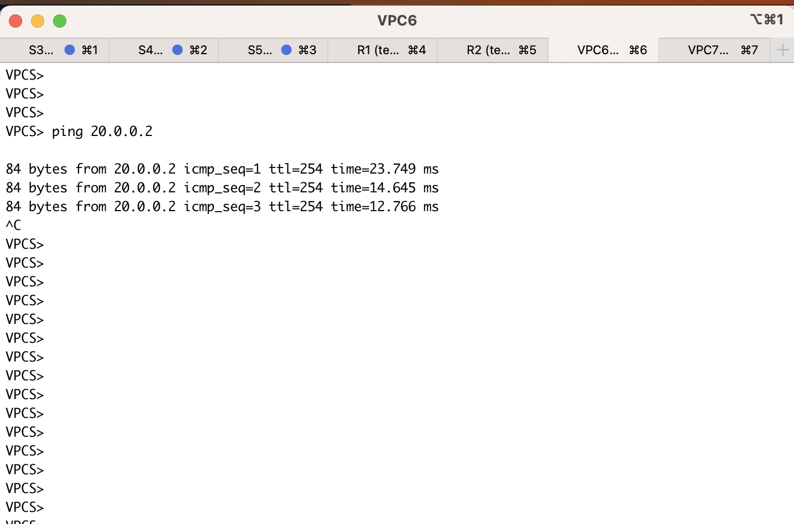
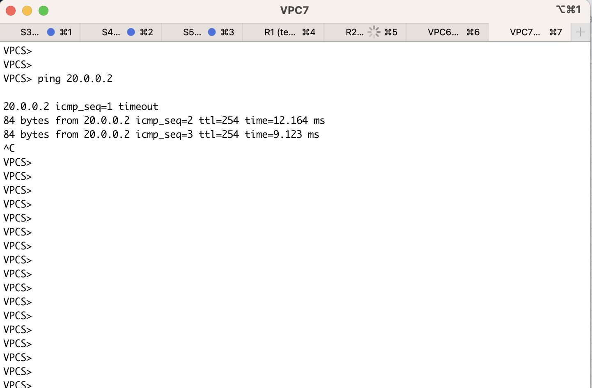
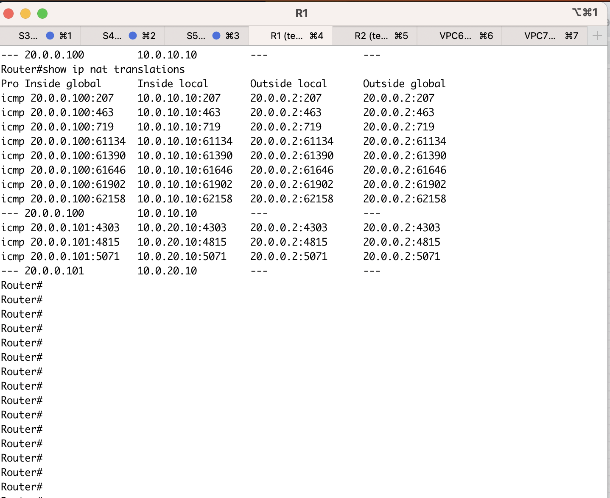
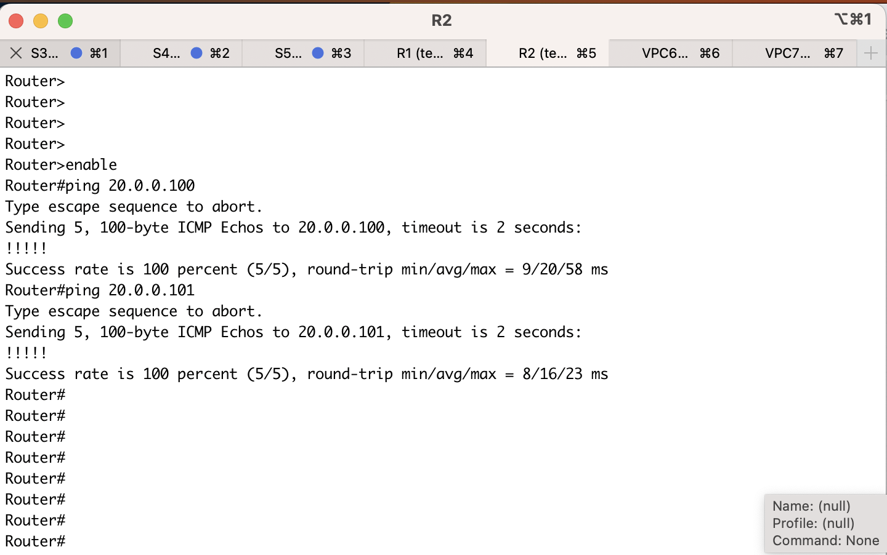

# Сделал на 10 баллов

Топология лежит в [hw3.unl](data/hw3.unl)

Конфиги всех нод лежат в [data](data/)
## Скриншот конфигурации


## Список команд по нодам

### S3 (Switch cisco L2)
```
enable 
configure terminal 
vlan 10
vlan 20
exit 

spanning-tree vlan 10 root primary
spanning-tree vlan 20 root primary

interface e0/0
switchport trunk allowed vlan 10,20
switchport trunk encapsulation dot1q
switchport mode trunk
exit 
interface e0/1
switchport trunk allowed vlan 10,20
switchport trunk encapsulation dot1q
switchport mode trunk
exit 
interface e0/2
switchport trunk allowed vlan 10,20
switchport trunk encapsulation dot1q
switchport mode trunk
exit 
exit 
copy running-config startup-config 
```
### S4 (Switch cisco L2)

```
enable 
configure terminal 
vlan 10
vlan 20
exit 
interface e0/0
switch access vlan 10
switch mode access
exit 
interface e0/1
switchport trunk allowed vlan 10,20
switchport trunk encapsulation dot1q
switchport mode trunk
exit 
interface e0/2
switchport trunk allowed vlan 10,20
switchport trunk encapsulation dot1q
switchport mode trunk
exit 
exit 
copy running-config startup-config 
```

### S5 (Switch cisco L2)

```
enable 
configure terminal 
vlan 10
vlan 20
exit 
interface e0/0
switch access vlan 20
switch mode access
exit 
interface e0/1
switchport trunk allowed vlan 10,20
switchport trunk encapsulation dot1q
switchport mode trunk
exit 
interface e0/2
switchport trunk allowed vlan 10,20
switchport trunk encapsulation dot1q
switchport mode trunk
exit 
exit 
copy running-config startup-config 
```

### R1 (Router cisco L3)

```
enable
configure terminal

ip nat pool NetPool 20.0.0.100 20.0.0.255 netmask 255.255.255.0
access-list 1 permit 10.0.10.0 0.0.0.255
access-list 1 permit 10.0.20.0 0.0.0.255
ip nat inside source list 1 pool NetPool

interface e0/0
no shutdown
interface e0/0.10
ip nat inside
encapsulation dot1q 10
ip add 10.0.10.1 255.255.255.0
ip dhcp excluded-address 10.0.10.1 10.0.10.9
ip dhcp pool LAN-POOL-1
network 10.0.10.0 255.255.255.0
default-router 10.0.10.1
dns-server 8.8.8.8
exit 
interface e0/0
no shutdown
interface e0/0.20
ip nat inside
encapsulation dot1q 20
ip add 10.0.20.1 255.255.255.0
ip dhcp excluded-address 10.0.20.1 10.0.20.9
ip dhcp pool LAN-POOL-2
network 10.0.20.0 255.255.255.0
default-router 10.0.20.1
dns-server 8.8.8.8
exit 
interface e0/1
no shutdown
ip add 20.0.0.1 255.255.255.0
ip nat outside
exit
exit
copy running-config startup-config 
```

### R2 (cisco router L3)

```
enable
configure terminal
interface e0/0
no shutdown 
ip add 20.0.0.2 255.255.255.0
exit 
exit 
copy running-config startup-config 
```

### VPC 

```
ip dhcp
```


## Проверка выданных IP и пинг в VLAN10/VLAN20

### VPC6

### VPC7


Видно, что всем выдался первый ip с dhcp сервера как мы и настроили пропуская первые 10 штук.

Пинги в VLAN так же работают корректно (скопировали их из дз 1)

## DHCP сервер 

### R1


Видно, что выдали по одному адресу в каждой VLAN и что сейчас указатель стоит на **.11 в обоих сетях -- все как надо.

Так же клиенты получают dns и default gateway (как следует из выполненых команд и конфигов)

## NAT

поставили верхний роутер в сеть 20.0.0.2/24. Таким образом он никак не может быть пропингован из сетей нижнего роутера. Ответ обратно просто не доходит без NAT. 

Нижний роутер имеет на верхнем порту адрес 20.0.0.1/24 (как показано на схеме)

Настроили NAT как показано в командах (сделали динамический pool) тем самым поддержали возможность добавления прозвольного количества хостов без лишней конфигурации (как в критериях)

### Пингуем 20.0.0.2 с VPC6

### Пингуем 20.0.0.2 с VPC7


### R1


Как видно, после пинга 20.0.0.2 с обоих нод записались адреса (начинали выдавать начиная с 20.0.0.100/24 чтобы точно пересечений не было)

Так же мы настроили access листы только на VLAN10, VLAN20 -- только для этих локальных сетей будут выдаваться айпишники во внешний мир

Так же по выданным айпишникам можно пропинговать компьютеры 

### R2



Как видно из настроек, верхний маршрутизатор по дефолту ничего не знает про локальные сети VLAN10 и VLAN20. У него вообще очень простая настройка
