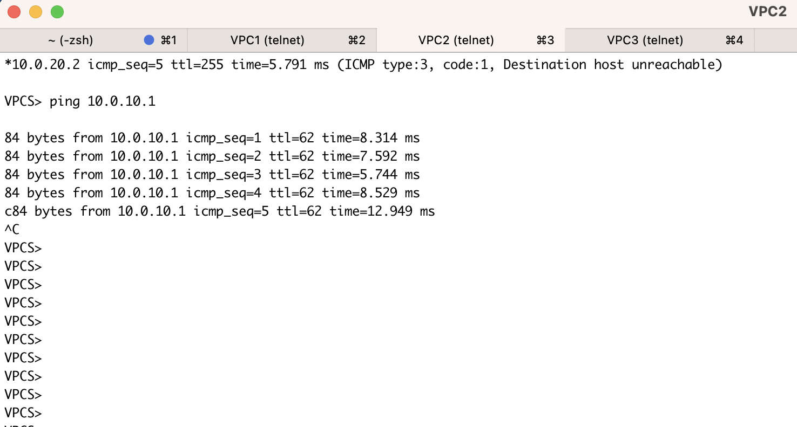

# Сделал все без шифрования

## Схема 

## Инструкции

### VPC1
```
ip 10.0.10.1/24 10.0.10.2
```

### VPC2
```
ip 10.0.20.1/24 10.0.20.2
```

### VPC3
```
ip 10.0.30.1/24 10.0.30.2
```

Сделали 3 разные сети

### R5
```
enable
configure terminal
interface e0/0
no shutdown
ip address 20.0.10.2 255.255.255.0
exit
interface e0/1
no shutdown
ip address 20.0.20.2 255.255.255.0
exit
interface e0/2
no shutdown
ip address 20.0.30.2 255.255.255.0
exit
exit
copy running-config startup-config 
```

Знает только про directly connected сети 

### R4

```
enable
configure terminal
interface e0/1
no shutdown
ip address 10.0.10.2 255.255.255.0
exit
interface e0/0
no shutdown
ip address 20.0.10.1 255.255.255.0
exit

ip route 0.0.0.0 0.0.0.0 20.0.10.2
ip route 10.0.20.1 255.255.255.255 100.20.0.2
ip route 10.0.30.1 255.255.255.255 100.30.0.2

interface tunnel 20
ip address 100.20.0.1 255.255.255.0
tunnel source 20.0.10.1
tunnel destination 20.0.20.1
ip mtu 1400
ip tcp adjust-mss 1360
exit

interface tunnel 30
ip address 100.30.0.1 255.255.255.0
tunnel source 20.0.10.1
tunnel destination 20.0.30.1
ip mtu 1400
ip tcp adjust-mss 1360
exit
exit
copy running-config startup-config
```

### R6
```
enable
configure terminal
interface e0/1
no shutdown
ip address 10.0.20.2 255.255.255.0
exit
interface e0/0
no shutdown
ip address 20.0.20.1 255.255.255.0
exit

ip route 0.0.0.0 0.0.0.0 20.0.20.2
ip route 10.0.10.1 255.255.255.255 100.20.0.1

interface tunnel 20
ip address 100.20.0.2 255.255.255.0
tunnel source 20.0.20.1
tunnel destination 20.0.10.1
ip mtu 1400
ip tcp adjust-mss 1360
exit
exit
copy running-config startup-config
```

### R7
```
enable
configure terminal
interface e0/1
no shutdown
ip address 10.0.30.2 255.255.255.0
exit
interface e0/0
no shutdown
ip address 20.0.30.1 255.255.255.0
exit

ip route 0.0.0.0 0.0.0.0 20.0.30.2
ip route 10.0.10.1 255.255.255.255 100.30.0.1

interface tunnel 30
ip address 100.30.0.2 255.255.255.0
tunnel source 20.0.30.1
tunnel destination 20.0.10.1
ip mtu 1400
ip tcp adjust-mss 1360
exit
exit
copy running-config startup-config
```

## Проверка 

Прикрепляю скриншоты пингов в тоннелях и между нодами 

### VPC1


### VPC2


### VPC3

